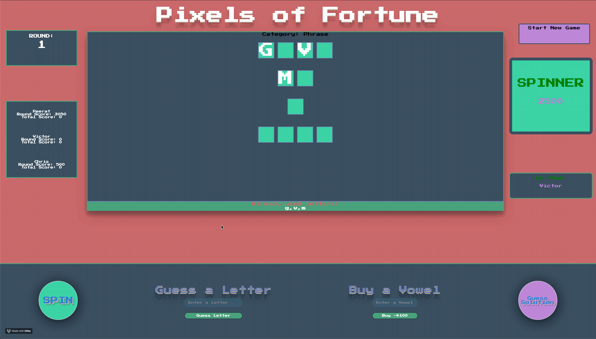
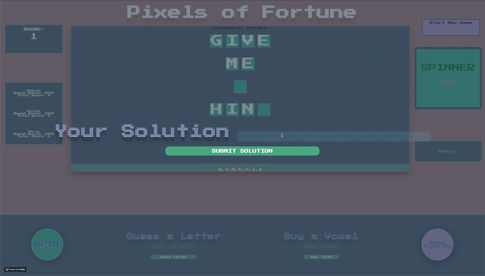
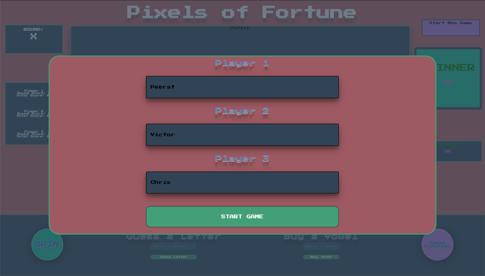
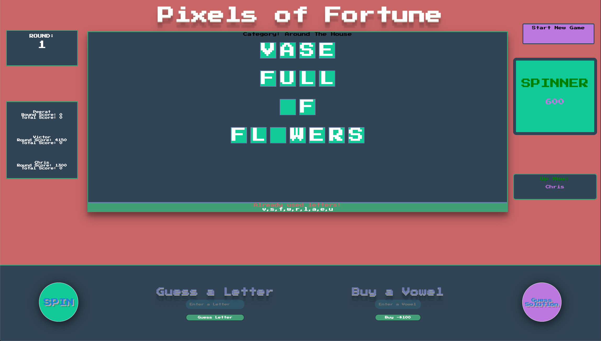

# Game-Time

## [Pixels of Fortune Live Site](https://peeratmac.github.io/game-time/src/index.html)

### [Peerat Sukcharoenyingyong](https://github.com/peeratmac) [Victor Abraham](https://github.com/VPAbraham) [Chris Basham](https://github.com/chrisdbasham317)

## Working Product

## Languages and Libraries

- JavaScript
- Implement OOP Designs in the game
- fetch API
- jQuery
- HTML
- CSS (Sass)

## Unit Testing

- Class and Methods Testing
- UI Testing - DOM Manipulation
- Mocha
- Chai

## Goals and Objectives

- Write a program from scratch
- Synthesize knowledge of OOP, classes, and JS fundamentals to create a playable game
- Demonstrate good GitHub collaboration and workflow within a large group
- Write modular, reusable code that follows SRP (Single Responibility Principle)
- Create a robust test suite that thoroughly tests all functionality of a client-side application
- Implement array iterator and mutator methods to work with game data

## Screenshots

## Future Functionalities

- x
